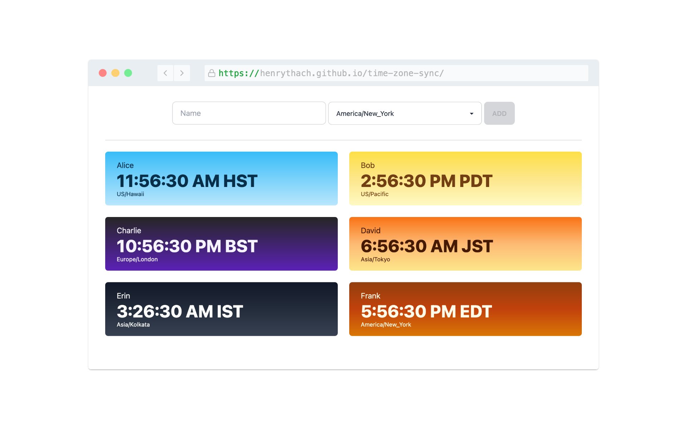

# time-zone-sync



Your new best friend for sorting out the who's-awake-when puzzle of running a global team. With real-time tracking, powered by slick SvelteKit tech, you'll be scheduling meetings that everyone can actually attend.

## Features

- Add, edit, and remove team member time zones
- Real-time display of local times
- Link sharing for the current state of the app
- SvelteKit for fast performance and server-side rendering
- Data saved to Local Storage for persistence

## Getting Started

These instructions will get you a copy of the project up and running on your local machine for development and testing purposes.

### Prerequisites

- Node.js (v14.0.0 or higher)
- npm (v7.0.0 or higher)

### Installing

1. **Clone the repository:**

   ```
   git clone https://github.com/your-username/time-zone-sync.git
   ```

2. **Navigate to the project directory:**

   ```
   cd time-zone-sync
   ```

3. **Install dependencies:**

   ```
   npm install
   ```

### Development

Run the development server using:

```
npm run dev
```

## Acknowledgments

- [Svelte](https://svelte.dev/) for being a fun library to learn
- [Moment Timezone](https://momentjs.com/timezone/) for reliable time zone conversions
- [screenshot.rocks](https://github.com/daveearley/screenshot.rocks) for the generating the screenshot in this README

## Support

For any questions or concerns, please open an issue or submit a pull request.
